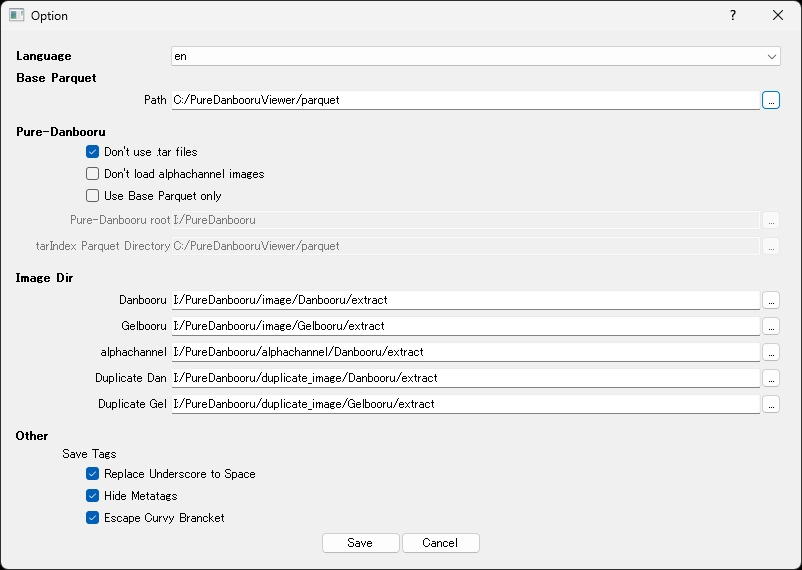

# Pure-Danbooru Viewer

[日本語](#概要) | [English](#overview)

## 概要：

このプログラムはWarriorMama777氏が公開されたPure-Danbooruのデータ閲覧アプリケーションです。
DanbooruおよびGelbooruにおけるタグ検索を模倣し、学習に使用したい画像の抽出を助けます。\
　https://huggingface.co/datasets/WarriorMama777/pure-danbooru/

## スクリーンショット

## 対応言語
- 日本語
- 英語(AI-translated)
- [任意で追加可能](#language)

## 動作環境
- Python 3.x

## インストール
  ***事前にローカルの任意の場所へPure-Danbooruを用意してください***
1. ローカルの任意の場所へこのリポジトリを`git clone`
2. `Download_Parquet.bat` を実行
3. `PureDanbooruViewer.bat` を実行

## 各画面の説明
### メインウィンドウ

### 各項目の説明
#### メニューバー
- Save Config: config.iniに現在の設定を保存します
- Option: オプション画面を表示します
- Lang: プログラムの言語設定を変更します

## メイン画面
- Limit Results: 検索実行時の詳細画面への表示数を制限します
                 限界値は1,000,000件としています
- Data Source: 検索対象を選択します
- Tags Area: 画像を絞り込むためのタグを入力していきます\
             入力欄左の×マークの押下で選択行の削除が可能です\
             今のところワイルドカード(*)を使用したあいまい検索には対応していません
- Search: 現在入力されているタグ群での検索を実行し、詳細画面を開きます
- Clear Tags: 現在入力されているタグを全て消去します
- Tag Viewer: タグビューワーを開きます
- :mag_right:: Post IDに入力されている値でプレビュー画面を開きます

### 特殊な操作
- F1キー: オプション画面を表示します
- Ctrl + S: config.iniに現在の設定を保存します
- Ctrl + Enter: 現在入力されているタグ群での検索を実行し、詳細画面を開きます (Searchボタンと同じ動作)
- (Post ID入力欄で) Enter: 入力した値でプレビュー画面を開きます (:mag_right:ボタンと同じ動作)

#### 検索結果画面

### 各項目の説明
- Export CSV: 現在表示されている情報をcsvとして出力します
- Preview: プレビュー画面を開きます
- Auto Preview: プレビューボタンの操作を省略し、セルを選択した際にプレビュー画面を表示または更新します
- Save alpha: Save IMG/Bothを実行する際にalphachannelの画像も保存します
- Save With: Save IMG/Tags/Bothを実行する際のファイル保存名を選択します
- Save IMG: 選択されているセル(範囲指定可能)の画像を保存します
- Save Tags: 選択されているセル(範囲指定可能)のタグ情報を保存します
- Save Both: 選択されているセル(範囲指定可能)の画像とタグ情報を保存します

### 特殊な操作
- 任意のセルをダブルクリック: 選択された行のIDを取得してプレビュー画面を表示します
- (任意のセルを選択後) Enter: 選択された行のIDを取得してプレビュー画面を表示します
- (任意のセルを選択後) Ctrl + C: 選択されたセルの値をクリップボードにコピーします

## プレビュー画面

### 各項目の説明
- :earth_asia:: 現在表示されている画像に対応するDanbooruまたはGelbooruのページを開きます
- Alpha: 現在表示されている画像に対応するalphachannelの画像を表示します
- Save With: Save IMG/Tags/Bothを実行する際のファイル保存名を選択します
- Save IMG: 現在表示されている画像を保存します
- Save Tags: 現在表示されているタグ情報を保存します
- Save Both: 現在表示されている画像とタグ情報を保存します
- Save Group: 現在表示されている画像群の画像とタグ情報を保存します

### タグビューワー

### 各項目の説明
- Tag: 検索するタグを入力します\
       この画面ではワイルドカードによるあいまい検索が使用可能です
- Limit: タグ検索時の表示限界数を制限します
- Category: 検索するタグにカテゴリーフィルタをかけたい場合に使用します
- Order: 検索結果の表示順を設定します

### 特殊な操作
- 任意のセルをダブルクリック: 選択行のタグをメインウィンドウへ転送します
- (任意のセルを選択後) Ctrl + C: 選択されたセルの値をクリップボードにコピーします

## オプション画面

### 各項目の説明
#### Language
  選択した言語に応じてオプション画面や各種ダイアログで表示される一部文言が変更されます\
  langフォルダにlang.〇〇.ymlというファイルを作成することで任意の言語、あるいは表現設定を増やすことが可能です

#### Base Parquet
- Path: 本プログラムに必須のparquetファイルの保存先を指定します\
        `Download_Parquet.bat`を使用した場合、プログラムのある場所にparquetフォルダを作成して格納されているはずです

#### Pure-Danbooru
- tarファイルを使用しない: Pure-Danbooruの中にある画像関連の圧縮ファイルを解凍済みの場合に使用してください **このオプションの利用を強く推奨します**
- alphachannel画像を読み込まない: 各種保存やプレビュー表示の際にアルファ画像を読み込みません
- Parquetファイルだけで動作させる: 画像の読み込みを省略し、プラグラムの動作をparquet内の文字データだけでやりくりします
- Pure-Danbooru root: Pure-Danbooruのパスを指定してください
- tarIndex Parquetフォルダ: tarIndex_〇〇.parquetの保存先を指定してください
　　　　　　　　　　　　　　　`Download_Parquet.bat`を使用した場合、ベースparquetと同じ場所に格納されているはずです

#### Image Dir
  tarファイルを使用しない場合のみ使用可能です\
  **ダイアログでフォルダを選択する際、OSが中身を読み込もうとしてダイアログが固まることがあります**\
  **そういった状況に陥った場合は直接選択せずにパスを書き換える等で回避してください**
- Danbooru: `Pure-Danbooru\image\Danbooru` に格納されている圧縮ファイルの解凍先を指定してください
- Gelbooru: `Pure-Danbooru\image\Gelbooru` に格納されている圧縮ファイルの解凍先を指定してください
- alphachannel: `Pure-Danbooru\alphachannel` に格納されている圧縮ファイルの解凍先を指定してください
- Duplicate Dan: `Pure-Danbooru\duplicate_image\Danbooru` に格納されている圧縮ファイルの解凍先を指定してください
- Duplicate Gel: `Pure-Danbooru\duplicate_image\Gelbooru` に格納されている圧縮ファイルの解凍先を指定してください

#### Other
#### Save Tags
- プレビュー画面の表示、あるいはタグを保存する際の設定です

## 既知の問題
#### `Pure-Danbooru\json`に纏められているデータに欠落が存在する
  illustrationの付与やbad_id, highres等のメタタグ除去による違いといった話ではなく、\
  `Pure-Danbooru\metadata`から纏めるにあたって一部のタグ情報が欠落してしまっているようです。(例:ID 4260582 (Danbooru))\
  そのため、本プログラムでは`Pure-Danbooru\metadata`から生成したタグ情報を利用しています。\
  もしそちらのデータで利用したいという場合、\
  Huggingfaceに`Dan_rels_BigJSON.parquet`と`Dan_tags_BigJSON.parquet`を置いてありますので適宜差し替えてご利用ください。

## ライセンス
このプログラムは MIT ライセンスに準拠します\
  https://opensource.org/license/mit
\
\
** Translated by Claude 3.5 Haiku **
## Overview

This program is a data viewing application for Pure-Danbooru, published by WarriorMama777.\
It mimics tag search functionality in Danbooru and Gelbooru, helping to extract images for learning purposes.\
  https://huggingface.co/datasets/WarriorMama777/pure-danbooru/

## Screenshots

## Supported Languages
- Japanese
- English(AI-tranlated)
- [Can be additional](#language-1)

## System Requirements
- Python 3.x

## Installation
  ***Please prepare Pure-Danbooru in a local directory in advance***
1. Clone this repository to a local directory using `git clone`
2. Execute `Download_Parquet.bat`
3. Execute `PureDanbooruViewer.bat`

## Window Descriptions
### Main Window

### Item Descriptions
#### Menu Bar
- Save Config: Saves current settings to config.ini
- Option: Displays the options window
- Lang: Changes the program language settings

## Main Window
- Limit Results: Limits the number of items displayed in the details window when searching. Maximum limit is 1,000,000 items.
- Data Source: Select the search target
- Tags Area: Enter tags to filter images\
             The × mark on the left side of the input field can delete the selected line\
             Currently does not support wildcard (*) fuzzy searches

- Search: Execute search with current tag group and open the details window
- Clear Tags: Clears all currently entered tags
- Tag Viewer: Opens the tag viewer
- :mag_right:: Opens preview window with the entered Post ID

### Special Operations
- F1 key: Display options window
- Ctrl + S: Save current settings to config.ini
- Ctrl + Enter: Execute search with current tag group and open details window (same as Search button)
- (In Post ID input field) Enter: Open preview window with entered value (same as :mag_right: button)

## Search Results Window

### Item Descriptions
- Export CSV: Export currently displayed information as CSV
- Preview: Open preview window
- Auto Preview: Display or update preview window when selecting a cell, skipping preview button operation
- Save alpha: Save images with alpha channel when executing Save IMG/Both
- Save With: Select filename when saving IMG/Tags/Both
- Save IMG: Save images of selected cells (range selection possible)
- Save Tags: Save tag information of selected cells (range selection possible)
- Save Both: Save images and tag information of selected cells (range selection possible)

### Special Operations
- Double-click any cell: Display preview window with ID of selected row
- (After selecting a cell) Enter: Display preview window with ID of selected row
- (After selecting a cell) Ctrl + C: Copy cell value to clipboard

## Preview Window

### Item Descriptions
- :earth_asia:: Open corresponding Danbooru or Gelbooru page for currently displayed image
- Alpha: Display alpha channel image corresponding to currently displayed image
- Save With: Select filename when saving IMG/Tags/Both
- Save IMG: Save currently displayed image
- Save Tags: Save currently displayed tag information
- Save Both: Save currently displayed image and tag information
- Save Group: Save images and tag information of current image group

## Tag Viewer

### Item Descriptions
- Tag: Enter tag to search. Wildcard fuzzy search is available in this window
- Limit: Limit the number of displayed results when searching tags
- Category: Use to apply category filter when searching tags
- Order: Set the display order of search results

### Special Operations
- Double-click any cell: Transfer selected row's tag to main window
- (After selecting a cell) Ctrl + C: Copy cell value to clipboard

## Options Window

### Item Descriptions
#### Language
  Some text in options window and various dialogs will change according to the selected language.\
  By creating a lang.〇〇.yml file in the lang folder, you can add arbitrary language or expression settings.

#### Base Parquet
- Path: Specify the save location for parquet files\
        When using `Download_Parquet.bat`, a parquet folder will be automatically created in the program's location

#### Pure-Danbooru
- Don't use .tar files: Use when image-related compressed files in Pure-Danbooru are already extracted **We strongly recommend using this option**
- Don't load alphachannel images: Do not load alpha images when saving or previewing
- Use Base Parquet only: Omit image loading and operate the program with only text data in parquet
- Pure-Danbooru root: Specify path to Pure-Danbooru
- tarIndex Parquet Directory: Specify save location for tarIndex_〇〇.parquet\
  When using `Download_Parquet.bat`, already stored in the same location as base parquet

#### Image Dir
  Available only when not using tar files\
  **When selecting a folder in a dialog, sometimes the dialog freezes as the OS tries to read its contents**\
  **If such a situation occurs, avoid direct selection and modify the path directly**
- Danbooru: Specify extraction destination for compressed files stored in `Pure-Danbooru\image\Danbooru`
- Gelbooru: Specify extraction destination for compressed files stored in `Pure-Danbooru\image\Gelbooru`
- alphachannel: Specify extraction destination for compressed files stored in `Pure-Danbooru\alphachannel`
- Duplicate Dan: Specify extraction destination for compressed files stored in `Pure-Danbooru\duplicate_image\Danbooru`
- Duplicate Gel: Specify extraction destination for compressed files stored in `Pure-Danbooru\duplicate_image\Gelbooru`

#### Other
#### Save Tags
- Settings for displaying preview window or saving tags

## Known Issues
#### Data compiled in `Pure-Danbooru\json` has some omissions
  This is not about differences due to `illustration` addition or removal of meta tags like `bad_id`, `highres`, etc.\
  It seems some tag information is missing when compiling from `Pure-Danbooru\metadata`(e.g., ID 4260582 (Danbooru))\
  Therefore, this program uses tag information generated from `Pure-Danbooru\metadata`\
  If you want to use that data, \
  `Dan_rels_BigJSON.parquet` and `Dan_tags_BigJSON.parquet` are available on Huggingface, so please replace them as needed.

## License
This program is licensed under the MIT license.\
  https://opensource.org/license/mit
